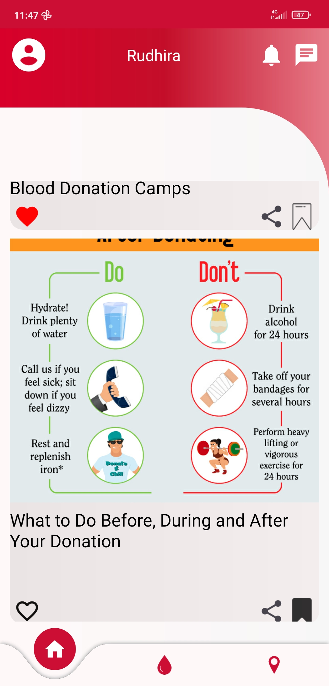
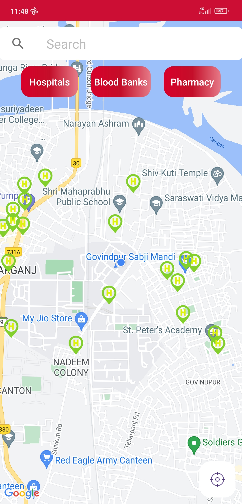
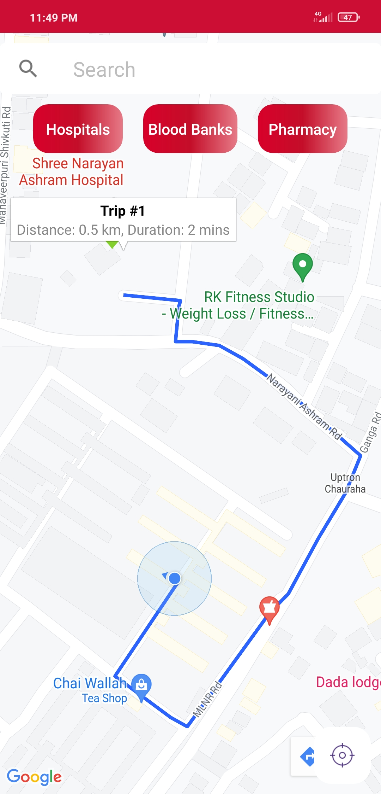
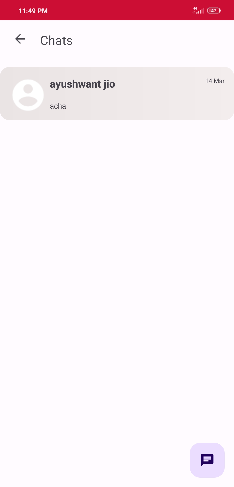

# Blood-Donation-App

## TECH STACK
Android(JAVA), Firebase, Google Maps API

## Intuition for the app - 
As we saw during Covid times that plasma donations of the cured patients could save lives. So the search for blood donors was at an all-time high. Everyone started looking for ways to contact blood donors, but there was no efficient system that could handle and manage all of these requirements. 
A system didn't exist that could connect the available blood donors and seekers in a region. Thus even if the options were available, they were not visible.

## FEATURES
1. Our android app Rudhira aims to provide an efficient system to connect blood donors and seekers in every region through an efficient and verified system. 
2. The people who seek blood can register their requests and location in our app along with the documents. The local admin then verifies these requests, and if they're legible, approves them. The request is then visible to all our users. 
3. Blood donors can view already available requests and if possible can reach out and help the seekers. 
4. Blood donors can also register along with their blood group, medical documents and other data. Once verified, they're then publicly available (subject to consent) and can be reached out directly.
5. Our data is also available on a map where users can search nearby hospitals, pharmacy among other things with just a single click of a button. 
6. We have a chat feature to help registered users chat amongst themselves. 
7. The feed provides the latest updates regarding blood donation facts and nearby camps.

## Screenshots
                

                 

              

        

